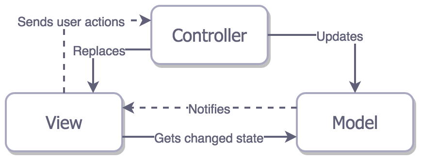
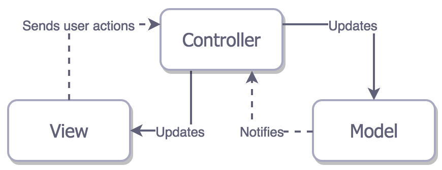
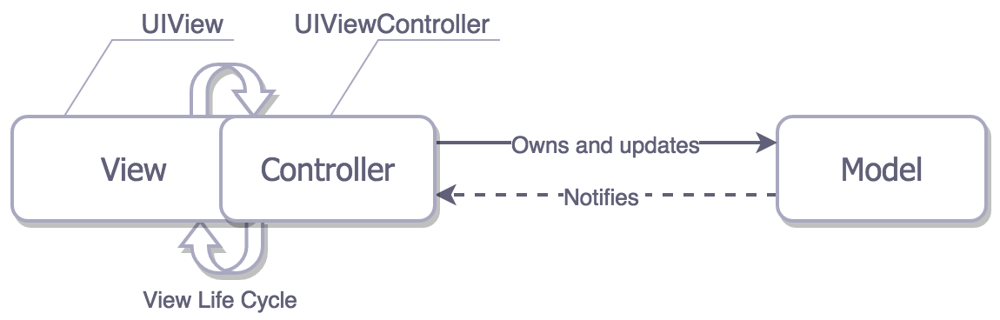
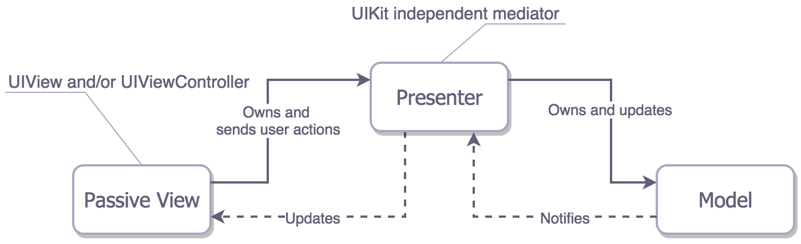
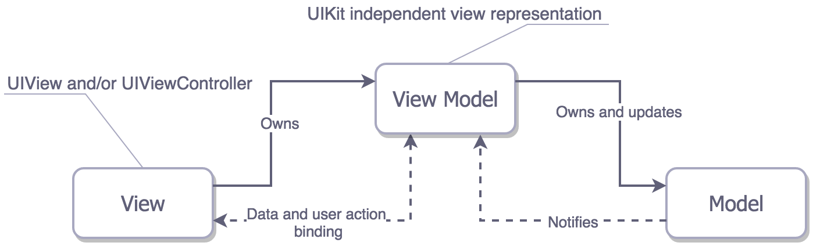

## 아키텍쳐의 종류

MV 가 포함된 패턴은 다음과 같다.

- MVC
- MVP
- MVVM

여기서 M(Model) 은 domain data 나 data access layer 를 책임진다.
V(View)는 presentation layer(GUI) 를 책임진다. iOS 에서는 UI 로 시작하는 모든것이다.

Controller, Presenter, ViewModel 은 Model 과 View 사이의 중재자이다. 일반적으로 View 의 사용자 액션에 대응하고, Model 의 변경사항을 업데이트 하여 Model을 변경하는 역할(책임)을 한다.

엔티티를 나누면 다음과 같은 이점이 있다 :

- 훨씬 이해하기 쉬워짐
- 재사용
- 독립적으로 테스트 가능

### 1. MVC



Model 이 변경되면 Controller 에 의해 rerendering 되어 진다.
View 는 stateless 한 상태가 된다. (상태를 저장하지 않는다.)
iOS 앱에서 이와같이 전통적인 MVC 패턴으로 구현하는것은 아키텍쳐 문제때문에 가능하지 않다.
세개의 엔티티가 모두 밀접하게 결합되어 있고, 각 엔티티는 나머지 두 엔티티에 대해 알고 있다. 이런 상태는 애플리케이션의 재사용성을 크게 저하 시킨다.

> 전통적인 MVC 패턴은 iOS 개발에 적용되지 않는다.

### Apple's MVC (Massive View Controller)



- Model, View, Controller 로 이루어져 있다
- Model 과 View 사이에 위치한 Controller 가 중간 다리 (중재자)역할을 한다.
  View 와 Model 은 직접적으로 알지 못한다.
  예) Model이 변경되었을때 Controller 에게 알려서 View 갱신, View 의 입력을 받아 Controller 가 Model에 반영



Apple 이 예상했던 흐름은 깔끔해 보이지만, 실제 개발에서 코드를 분리하기는 어렵다.
View 와 Controller 가 밀접하게 붙어있기 때문이다. (뷰의 라이프 사이클에 관여됨)

대부분의 경우 View 의 책임은 Controller 로 작업을 보낸다. 결국 ViewController 는 모든것의 data source, delegate, 네트워크 요청과 취소를 하는 대부분의 작업을 수행하게 된다.

뷰컨트롤러가 View 와 밀접하게 연결되어 있기 때문에 테스트 하기 어려워 진다.
비지니스 로직와 레이아웃 코드가 분리될 필요가 있다.

- Model:
  struct, class 형태로 데이터를 들고 있다
- View:
  스크린상의 시각적 요소와 컨트롤들을 보여준다.
  보통 UIView 의 서브클래스 형태
- Controller:
  Model, View 를 컨트롤 한다.
  보통 UIVIewController 의 서브클래스 형태

아래와 같이 로직이 UIViewController 내부에 있어, UI 와 분리하여 테스트를 할 수 없다. :

```
// View + Controller
class HelloViewController : UIViewController {
    @objc func didTapButton() {
        let greeting = "Hello" + " " + self.person.name + ", " + self.person.age
        self.label.text = greeting
    }
}
```

> 장점:

- 빠르게 앱을 구현할 수 있다.

> 단점:

- 기능이 많아질수록 `ViweController` 에 코드가 계속 커지는 문제가 있다.

### 2. MVP



MVC 와 유사하게 생겼다. 하지만 중재자 역할을 하는 `Presenter` 가 `ViewController` 의 라이프 사이클과 상관이 없다.

따라서 `Presenter` 에는 레이아웃을 구성하는 코드가 전혀 없고, 데이터와 state 를 사용해 View 를 업데이트 하는 역할을 한다.

MVP 의 특징은 다음과 같다:

- 책임의 분배:
  `Presenter` 와 `Model`간에 대부분의 책임을 나눈다. `View` 를 멍청하게 한다(보여주기만!)
- 시험성:
  View 가 멍청해 짐으로 인해 대부분의 비지니스 로직을 테스트할 수 있다.
- 사용하기 쉽다:
  MVC 에 비해 코드 양이 두배로 증가하지만, 코드가 명확해 진다.

> 장점:

- 분리된 로직으로 인해 유닛 테스팅하기 좋다.
- `ViewModel에` UIKit 과 관련된 코드가 없기때문에, `ViewModel`을 이용해 로직을 테스트 하기 편하다.

> 단점:

- MVC 와 비교해 코드량 증가
- 데이터가 업데이트 되었을때 `Presenter` 에서 `View` 에게 일일이 지시해야 한다.
- ⇒ 이를 해결하기 위해 나온방법이 **MVVM**

### 3. MVVM (Model-View-ViewModel)


MV 종류중 최근에 나온 가장 좋은 패턴이다.

최근에 나왔기에 MV\* 가 이전에 직면했던 문제를 고려해 반영되었다.

MVVM 의 특징은 MVP 와 매우 비슷하다.:

- MVVM 에서는 ViewController 를 View 로 간주한다.
- View 와 Model은 분리되어 있으며, 커플링이 없다.
  View 는 Model 과 직접적인 바인딩이 아닌, ViewModel 과 바인딩 된다.

각 엔티티의 역활은 다음과 같다 :

- Model:

  View와 독립되어 있으며 앱에서 사용되는 실질적 데이터를 처리한다.
  Model 이 변경 되었을때, ViewModel 에게 알려준다(Notify)

- View:

  ViewController에 작성하며 View는 사용자와 상호작용이 직접적으로 일어나는 곳이다.
  ViewModel 을 바라보다가, 데이터가 변경되면 뷰를 업데이트 한다.

- ViewModel:

  View가 사용자와의 상호작용에 대한 event를 보내주면 그에 맞는 event를 model에게 알려주고

  반영된 데이터는 Data Binding을 통하여 View에게 알려준다

  주로 비즈니스 로직을 처리한다.

#### DataBinding의 방법

- **Key-Value Observing or KVO**
  Key Path를 사용하여 프로퍼티에 변화가 있을 때 noti를 받기 위한 매커니즘
- **Functional Reactive Programming or FRP**
  RxSwift, Combine 프레임워크
- **Delegation**
- **Property observers**

MVVM은 MVC에 비해 다음과 같은 이점을 제공해준다 :

- 복잡성 감소

  - MVVM은 많은 비즈니스 로직을 제거함으로서 ViewController를 단순하게 만든다.

- 표현식

  - ViewModel은 View의 비즈니스 로직을 더 잘 표현한다.

- 테스트

  - ViewModel은 View Controller보다 테스트하기가 훨씬 쉽다.
  - View 구현에 대해 걱정할 필요 없이 비즈니스 로직을 테스트하게 된다.

> 장점:

- 분리된 로직으로 인해 유닛 테스팅하기 좋다.

- ViewModel에 UIKit 과 관련된 코드가 없기때문에, VIewModel을 이용해 로직을 테스트 하기 편하다.
- View 와 ViewModel 이 바인딩되어, 데이터가 업데이트 됬을때 ViewModel 에서 일일이 처리하지 않아도 되어 코드양을 줄일 수 있다.(MVP 와 다른점)

> 단점:

- MVC 와 비교해 많아지는 코드량과 파일 생성.

### 2-2. MVVM & Repository (🐻곰튀김)

기존의 MVVM에 Repository를 더하여 세분화 한 구조.

특징으로는 다음과 같다:

- Model:

  - 서버 혹은 기기에서 받는 원천 데이터모델 Entity[^1]
  - 필요 데이터만 가져오도록하는 모델 Model
  - 화면에 보여줄 데이터를 세팅하는 ViewModel

- Logic:
  - API, Fetch를 통해 서버 혹은 기기와의 데이터를 전달받는 Repository[^2]
  - 필요한 정보만을 받도록 변형하는 Service
  - 모델과 로직을 합쳐 아래와 같은 구조를 가진다.
    - View → ViewModel → Service → Model → Repository → Entity
  - 위와 같은 구조의 장점으로는 기존의 ViewModel이 많은 비즈니스 로직을 가지던 것에서, 데이터 처리는 Service가 관리함으로서 책임이 분산되는 특징이 있다.
  - 또한 책임이 분산되고 세분화함에 따라 구조를 파악하기 쉬워지지만 작성해야하는 코드가 늘어난다는 단점이 있다

### 3. VIPER (View-Interactor-Presenter-Entity-Router)


MV\* 이 아닌 패턴.

VIPER 는 책임을 5가지로 분리하여 레이어를 구성한다.

- Entity:

  - 모델 객체 (data object)

- Interactor (data access layer):

  - Entity 를 조작
  - 서버에서 엔티티를 가져오는 것과 같은 data(엔티티) 또는 네트워킹과 관련된 비지니스 로직이 포함되어 있다.

- Presenter:

  - Interactor 에서 데이터를 가져오고 View에 반영.
  - UI 에 보여주기 위한 데이터를 만드는 비지니스 로직을 포함. (UIKit 에 독립적)

- Router:

  - 화면 전환을 담당.
  - '언제’ 화면을 전환할지 알고 있는 Presenter가 ‘어떻게’ 화면을 전환할지 알고 있는 Router에게 화면 전환을 요청한다

- View:
  - 화면 담당, 일반적으로 UI 접두어가 붙는다. (UIViewController, UIView, UIButton...etc)

기본적으로 VIPER 모듈은 하나의 화면 또는 전체 user story 가 될 수 있다.

MV\* 종류와 비교하면, 책임 분배에 몇가지 차이가 있다:

- Model 로직은 Entities 와의 Interactor 에 멍청한 data struct 로 들어간다.
- Controller/Presenter/ViewModel 의 UI 표시에 대한 책임만 Presenter 로 이동되고,
  데이터 변경 기능은 이동되지 않는다.
- VIPER 는 Router 에 의해 해결되어야 하는 navigation 의 책임을 다루는 첫번째 패턴이다.

> MV\* 패턴은 화면이동(라우팅) 을 다루지 못한다

VIPER 패턴의 특징은 다음과 같다:

- 책임의 분배:
  VIPER 는 책임분배에 있어 최고이다.
- 시험성:
  분배가 개선되어 테스트 하기 아주 좋다
- 사용하기 쉽다:
  작은 책임을 가지는 클래스를 위해 아주 많은 인터페이스를 작성해야 한다.

---

[^1]: 사전적 의미로는 ‘실체’, ‘존재’, ‘자주적인 것’, ‘본질’이다. 데이터베이스에서는 엔티티를 ‘실체’ 또는 ‘개체’라고 표현한다. 엔티티로 구성된 엔티티 집합이란 정보의 세계에서는 의미 있는 정보의 단위 또는 우리가 관리하고자 하는 두 개 이상의 속성과 두 개 이상의 개체를 지닌 동질성의 의미를 가진 독립적인 집합이다.(네이버지식백과)
[^2]: 애플리케이션 개발에 관련된 정보를 보관해 둔 데이터베이스.
