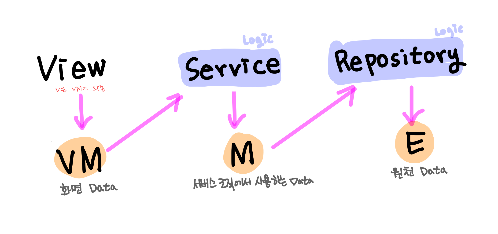

# 프로젝트 소개

MVVM 아키텍쳐를 적용한 토이프로젝트 입니다.
폴더의 구성은 다음과 같습니다:

## 의존성

ViewModel 의 데이터가 변경되면, 바인딩을 통해 View 의 UI 요소를 업데이트 합니다. View 는 ViewModel 을 의존한다고 볼 수 있으며, 전체적인 관계는 다음 이미지 처럼 나타나게 됩니다 :


### Entity(Data)

서버 API 또는 로컬 DB에서 가져온 원본 데이터 모델.

### Repository

Entity 를 서버나 로컬 DB에서 fetch 하는 역할

### Model(Data)

로직(Service) 에서 다루어질 실질적 데이터

### Service

어플리케이션의 핵심 비지니스 로직을 수행

- Repository의 Entity 모델을 로직에서 사용하는 Model로 변경
- Model 을 이용해 로직 수행

### ViewModel(Data)

- 화면에 보여질 데이터 Model 을 다룬다.
- Model -> ViewModel 로 변환

### View(UIViewController)

ViewModel 과 View 는 아래 코드와 같이 바인딩되어, ViewModel 에서 값이 업데이트 되면 View 도 업데이트 됩니다.
MVP 패턴에서는 ViewModel 에서 View에게 업데이트 하라고 지시해야 하지만, MVVM 에서는 이렇게 바인딩을 통해 해결 할 수 있는점이 장점인것 같습니다.

```swift
viewModel.onUpdated = { [weak self] in
    guard let self = self else { return }
    self.moviesLabel.text = self.viewModel.titlesString
}
```
